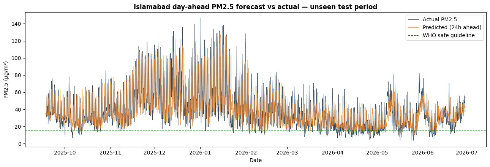
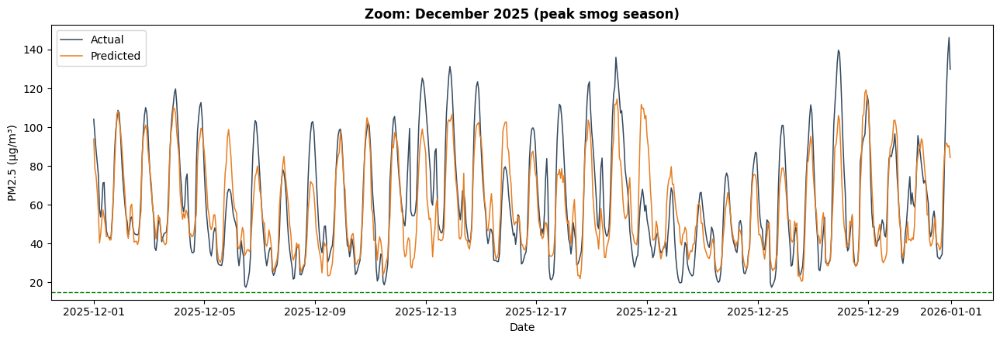
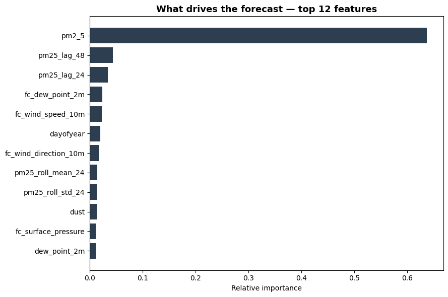

# 🌫️ AirCast — Day-Ahead PM2.5 Forecasting for Islamabad

**A machine-learning system that forecasts Islamabad's fine-particle air pollution (PM2.5) 24 hours ahead, turning Copernicus atmospheric-model and weather-reanalysis data into public-health early warnings for a city with no forecasting service of its own.**


🔗 **Live demo:** (https://krjngbxgmrwmfnrnd3uafp.streamlit.app/#next-24-hours-live-forecast-for-islamabad)
---

## Why this project exists

Islamabad has a serious air-quality problem and almost no public tool to forecast it. Across three years of hourly data (Aug 2022 – Jun 2026), the city's **average PM2.5 is 38.1 µg/m³ — roughly 2.5× the World Health Organization's safe guideline of 15 µg/m³** — and the worst hours reach **170+ µg/m³**, deep into the "very unhealthy" range. More than half of all hours exceed the WHO limit.

Major cities like Beijing and Delhi have operational air-quality forecasts; Islamabad largely does not. **AirCast** is a proof-of-concept that closes that gap using entirely free, open data — and it doubles as a bridge project connecting my computer-science background to my current work in climate and environmental informatics.

---

## What AirCast does

A two-tab Streamlit dashboard:

1. **📊 Explore & Results** — Islamabad's pollution patterns (the winter smog season, the daily traffic rhythm) and the model's *honest* performance on a time-separated test set it never saw during training.
2. **🔮 Live Forecast** — pulls the latest Islamabad data from Open-Meteo on demand, rebuilds the exact features the model was trained on, and predicts PM2.5 for the next 24 hours, with a health category and the weather drivers behind the forecast.

---

## Results

Evaluated on a **strictly time-separated** test set (trained on Aug 2022 – Sep 2025, tested on Sep 2025 – Jun 2026 — the model never sees the future during training):

| Model | MAE (µg/m³) | RMSE (µg/m³) | R² | vs. baseline |
|---|---|---|---|---|
| Persistence baseline ("tomorrow = today") | 9.00 | 12.73 | — | — |
| Random Forest (current conditions only) | 8.61 | 11.76 | 0.747 | +4.3% |
| **Random Forest (+ forecast weather)** | **8.02** | **10.95** | **0.780** | **+10.9%** |

The model explains **~78% of the hour-to-hour variation** in next-day PM2.5 and beats a strong persistence baseline by **~11%**. The gain over "current conditions only" comes almost entirely from adding **tomorrow's forecast wind and rain** — confirming the physical mechanism that clears the air.

<p align="center">
  <br>
  <em>Day-ahead forecast (orange) vs actual PM2.5 (grey) across the 9-month unseen test period — the model captures the full seasonal arc, including the winter smog wall.</em>
</p>

<p align="center">
  <br>
  <em>Zoom on December 2025 (peak smog): the forecaster tracks the daily rise-and-fall and most peaks a full day ahead.</em>
</p>

<p align="center">
  <br>
  <em>What drives the forecast: recent PM2.5 history plus forecast weather (wind, dew point) dominate — exactly as the atmospheric physics predicts.</em>
</p>

---

## Data

| Source | Variables | Coverage | Provider |
|---|---|---|---|
| Air quality | PM2.5, PM10, dust, NO₂, SO₂, CO, O₃, AOD | Aug 2022 – present, hourly | Copernicus **CAMS** via Open-Meteo |
| Weather | temperature, humidity, dew point, pressure, wind, precipitation | 1940 – present (ERA5), hourly | **ERA5** / Open-Meteo |

Both accessed through the free, keyless [Open-Meteo API](https://open-meteo.com/), licensed **CC BY 4.0**. Final modelling dataset: **34,243 unbroken hourly records** (0 missing hours, 0 duplicates) for Islamabad (33.68°N, 73.05°E).

---

## Method

- **Task:** regression — predict PM2.5 exactly **24 hours ahead** (a genuinely useful, non-trivial horizon; next-hour prediction is nearly a copy task).
- **Features (36):** current pollutants; PM2.5 lags (1–48 h) and rolling mean/std; cyclical time encodings (hour, month); and **forecast weather** at the target hour.
- **No data leakage:** every input uses only information available at forecast time; the target is 24 h in the future. Validated by construction.
- **Honest evaluation:** time-based train/test split (never random) and comparison against a persistence baseline, so the reported skill is real and not inflated.
- **Model:** `RandomForestRegressor` (120 trees, `min_samples_leaf=10`, `max_depth=25`) — deliberately constrained to a compact **7.8 MB** model that generalizes as well as a 60 MB unconstrained one.

---

## Honest limitations

Stated openly, because good science is transparent about its assumptions:

- **PM2.5 is modelled, not sensor-measured.** It comes from the Copernicus CAMS atmospheric model — a legitimate, widely used scientific product, but not a physical ground station. *(Phase 2: validate against the US Embassy Islamabad reference monitor.)*
- **Forecast-weather is an optimistic proxy.** In training, the "forecast" weather uses the *actual* recorded weather at the target hour. A real weather forecast carries error, so live-deployment skill will be slightly lower than the test metrics suggest. The live dashboard uses Open-Meteo's genuine weather forecast, exactly as operational systems do.
- **Sudden sharp spikes are the hard limit** of any 24-hour-ahead model; AirCast catches the trend and most peaks but not every abrupt event.

---

## Project structure

```
AirCast/
├── app.py                       # Streamlit dashboard (Explore + Live Forecast)
├── requirements.txt
├── models/
│   └── rf_pm25.pkl              # trained model + feature list + split index
├── data/
│   ├── islamabad_clean.csv      # cleaned hourly dataset
│   └── islamabad_features_v2.csv# modelling table (features + target)
├── figures/
│   ├── forecast_vs_actual.png
│   ├── forecast_vs_actual_zoom.png
│   └── feature_importance.png
└── notebooks/
    └── 01_load_data.ipynb       # full pipeline: load → clean → features → train
```

---

## Run it locally

```bash
git clone https://github.com/<your-username>/AirCast.git
cd AirCast
pip install -r requirements.txt
streamlit run app.py
```

> **Note:** pin `scikit-learn` in `requirements.txt` to the version used to train the model
> (check with `import sklearn; print(sklearn.__version__)`) to guarantee the model loads cleanly.

Deploy free on [Streamlit Community Cloud](https://share.streamlit.io): connect your GitHub repo, point it at `app.py`, and you get a public URL.

---

## Roadmap (Phase 2)

- Validate CAMS-modelled PM2.5 against the US Embassy ground monitor in Islamabad.
- Overlay CAMS's own PM2.5 forecast as a second benchmark alongside the ML model.
- Extend to Lahore and Karachi; add gradient-boosting and quantile forecasts for uncertainty bands.

---

## Author

**Muhammad Danyal Ikram**
MS, Climate Change & Environmental Informatics
_Bridging computer science and environmental monitoring through applied machine learning._

## Acknowledgements & citation

Air-quality and weather data © **Copernicus Atmosphere Monitoring Service (CAMS)** and **ECMWF ERA5**, served via **[Open-Meteo](https://open-meteo.com/)** under CC BY 4.0. This project uses these data with attribution as required by the licence.

> If you reference this work: Ikram, M. D. (2026). *AirCast: Day-Ahead PM2.5 Forecasting for Islamabad.* GitHub repository.
